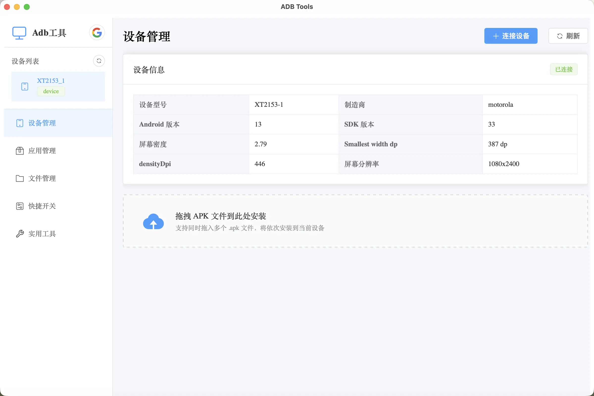
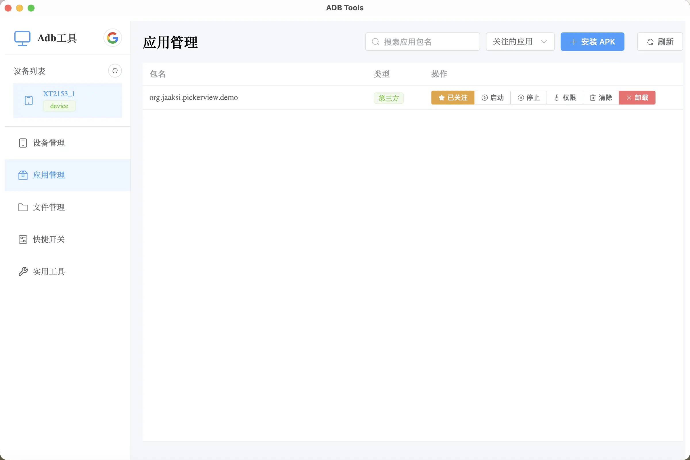
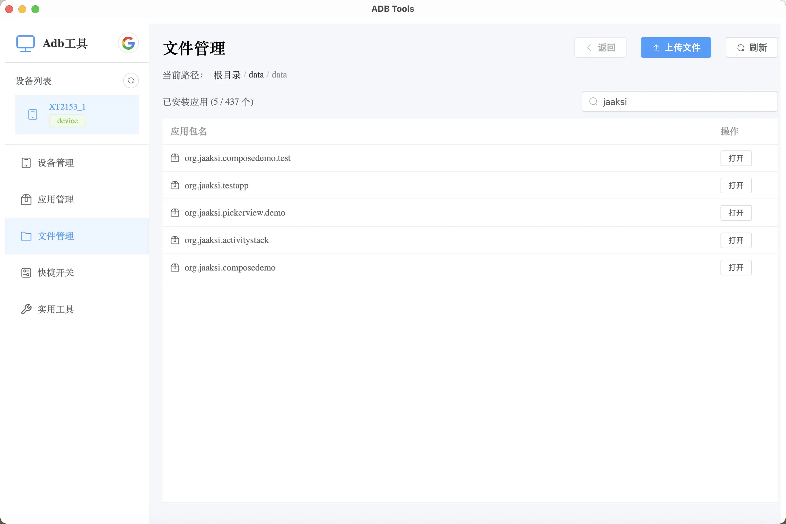
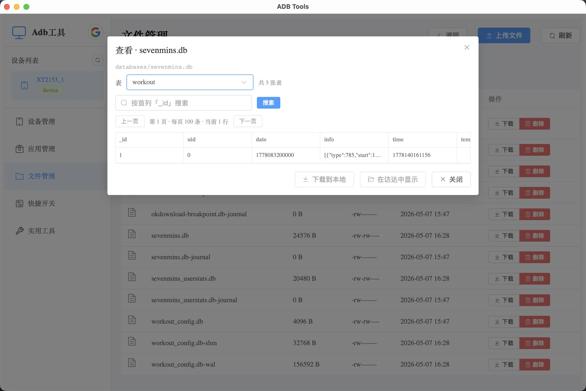
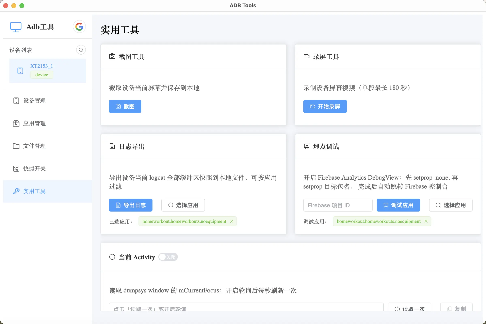
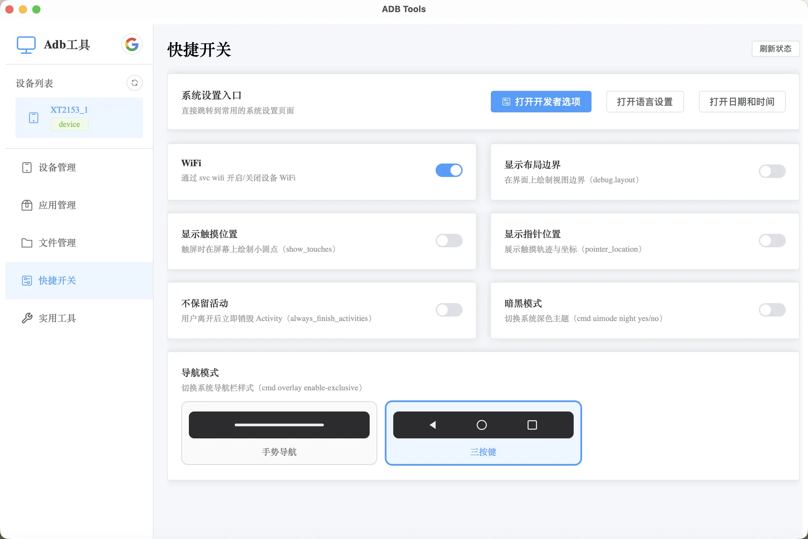

# ADB Tools

一个用 Tauri + Vue 3 + TypeScript 构建的跨平台 Android 调试工具，把日常 `adb` 操作收纳进一个直观的桌面 GUI，让 Android 开发与测试摆脱命令行。

[](https://tauri.app/)
[](https://vuejs.org/)
[](https://www.typescriptlang.org/)
[](LICENSE)

## ✨ 功能特性

### 📱 设备管理
- 自动发现 USB 与无线 ADB 设备
- 一键 `adb connect` / `disconnect`，按 IP+端口连接无线设备
- 实时显示设备型号、状态、分辨率、密度、smallestWidth dp 等信息

### 📦 应用管理
- 安装 / 卸载 APK，支持签名冲突时弹窗提示卸载
- 列出系统应用与用户应用，按关键字过滤
- 启动 / 停止 / 清除数据 / 查看包名
- 读取 APK 包名（基于 aapt）

### 📂 文件管理
- 浏览设备文件系统，支持普通目录与 `run-as` 沙盒目录
- 上传 / 下载 / 删除文件
- **内置文件查看器**：在线预览常见格式，无需 `adb pull` 到本地再用其他工具打开
  - **文本**：`.txt` / `.json` / `.log` 等文本文件直接渲染
  - **图片**：`.png` / `.jpg` / `.webp` 等直接预览
  - **XML**：高亮显示，支持**按 key 搜索**，快速定位 SharedPreferences 字段
  - **SQLite 数据库**：直接打开 `.db`，浏览表结构与数据，支持**按 key 搜索**记录

### 🔧 实用工具
- **截图**：一键保存设备截图到本地
- **录屏**：录制屏幕并保存为 mp4
- **当前 Activity**：实时轮询 TopActivity，便于定位页面
- **运行时权限**：可视化查看与切换应用权限
- **Firebase 埋点调试**：一键开启 Analytics Debug View
- **Shell 命令**：直接执行任意 `adb shell` 命令

### ⚡ 快捷开关
- WiFi 开关
- 深色模式切换
- 显示布局边界 / 触摸轨迹 / 指针位置
- 不保留活动
- 导航模式（手势 / 三键）切换
- 一键打开开发者选项 / 语言设置 / 日期设置

## 🖼️ 应用截图

### 设备管理（首页）



### 应用管理



### 文件管理



#### 应用文件查看器



支持直接查看 `.db` / `.xml` / `.txt` 等格式；SQLite 数据库与 XML 均支持**按 key 搜索**，调试 SharedPreferences 和应用本地存储非常方便。

### 实用工具



### 快捷开关



## 🚀 快速开始

### 环境要求

- [Node.js](https://nodejs.org/) ≥ 18
- [pnpm](https://pnpm.io/) ≥ 8
- [Rust](https://www.rust-lang.org/tools/install) ≥ 1.77（Tauri 2 要求）
- [adb](https://developer.android.com/tools/adb)（位于 `PATH`，或 Android SDK 默认路径）

各平台还需要 Tauri 的系统依赖，详见 [Tauri 官方文档](https://tauri.app/start/prerequisites/)。

### 开发运行

```bash
# 1. 克隆仓库
git clone https://github.com/<your-org>/adbtools.git
cd adbtools

# 2. 安装前端依赖
pnpm install

# 3. 启动开发模式（同时拉起 Vite + Tauri 窗口）
pnpm tauri dev
```

### 构建发布版

```bash
pnpm tauri build
```

构建产物位于 `src-tauri/target/release/bundle/`，包含 macOS `.dmg`、Windows `.msi`、Linux `.AppImage` / `.deb` 等。

## 🧱 技术栈

| 层级 | 技术 |
| --- | --- |
| 桌面框架 | [Tauri 2](https://tauri.app/) |
| 后端 | Rust（`std::process` 调用 adb，`rusqlite` 解析数据库） |
| 前端 | Vue 3 + `<script setup>` + TypeScript |
| UI 组件 | [Element Plus](https://element-plus.org/) |
| 状态管理 | Pinia |
| 构建工具 | Vite 6 |

## 📁 项目结构

```
adbtools/
├── src/                    # Vue 前端
│   ├── components/         # 各功能面板组件
│   │   ├── DevicePanel.vue
│   │   ├── AppManager.vue
│   │   ├── FileManager.vue
│   │   ├── ToolsPanel.vue
│   │   └── QuickTogglesPanel.vue
│   ├── stores/             # Pinia stores
│   └── App.vue
├── src-tauri/              # Tauri / Rust 后端
│   ├── src/lib.rs          # 所有 #[tauri::command] 入口
│   ├── Cargo.toml
│   └── tauri.conf.json
├── docs/screenshots/       # README 截图
└── package.json
```

## ❓ 常见问题

**Q：启动后显示找不到 adb？**
A：请确保 `adb` 已加入系统 `PATH`。程序也会尝试从 Android SDK 默认路径（`~/Library/Android/sdk/platform-tools` 等）查找。

**Q：无线连接失败？**
A：请先用 USB 执行一次 `adb tcpip 5555`，然后断开 USB，再使用本工具连接 `<手机IP>:5555`。

**Q：文件管理打不开 `/data/data/<package>`？**
A：非 root 设备需要应用是 debuggable 才能 `run-as`。本工具会自动检测，对不支持的应用会给出提示。

## 🤝 贡献

欢迎提交 Issue 与 PR。提交代码前请确保：

1. 前端通过 `vue-tsc --noEmit` 类型检查
2. Rust 通过 `cargo check`
3. 提交信息遵循项目原有风格（参见 `git log`）

## 📜 License

本项目基于 [Apache License 2.0](LICENSE) 开源。

```
Copyright 2026 jaaksi

Licensed under the Apache License, Version 2.0 (the "License");
you may not use this file except in compliance with the License.
You may obtain a copy of the License at

    http://www.apache.org/licenses/LICENSE-2.0
```
